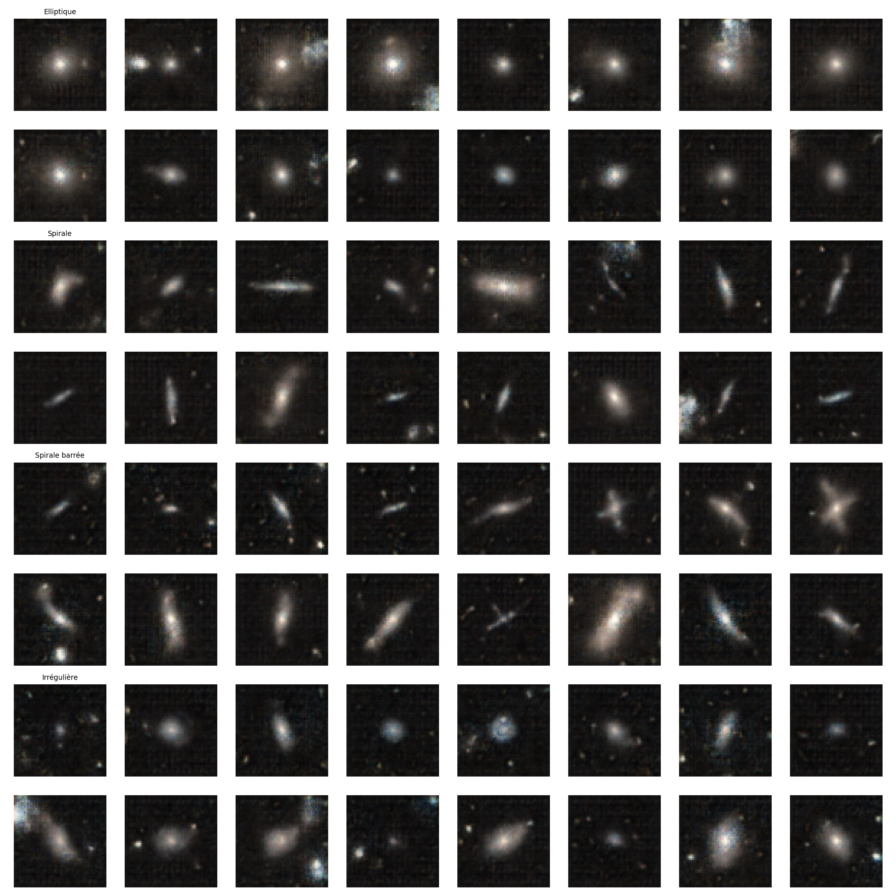

# Galaxy GAN

Génération de galaxies par classe avec un GAN conditionnel (cGAN).

## Classes
- 0 : Elliptique
- 1 : Spirale
- 2 : Spirale barrée
- 3 : Irrégulière


## Structure

<!-- TREEVIEW START -->
```bash
├── checkpoints/
├── data/
│   ├── processed/
│   └── raw/
├── models/
│   └── __pycache__/
├── outputs/
│   ├── eval/
│   ├── images/
├── test/
│   ├── __pycache__/
├── training/
│   ├── __pycache__/
└── utils/
    ├── __pycache__/
```

<!-- TREEVIEW END -->

## Usage
```bash
python -m train.train
python -m test.generate
```

## Resultat



